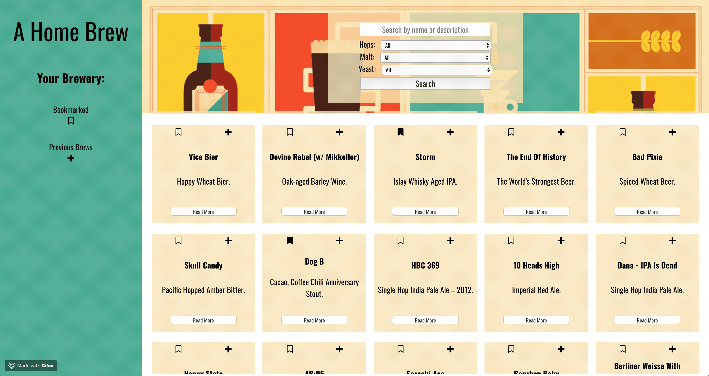
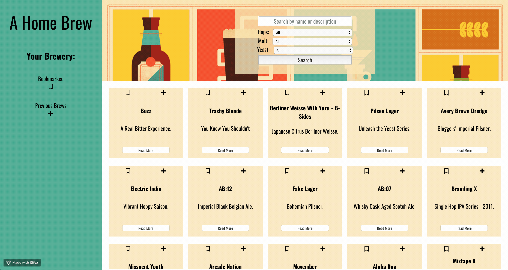

# A Home Brew

#### Welcome to A Home Brew, an application designed for the up and coming home brewer who want to transition from buying brew kits to purchasing their own brewing ingredients. The user can browse or search through 325 beers by style and name. Do you have extra hops, malt or yeast ingredients left over from a previous brew? Select that ingredient from the drop down menus and see all of the beers you can make with your leftover ingredients! Bookmark any beers you would like to brew in the future, and keep track of all of your previous brews!

## Table of Contents

- [Built With](#Built-With)
- [Screenshots](#Screenshots)
- [Features](#Features)
- [Try It Out](#Try-It-Out)
- [Take It For A Spin](#Take-It-For-A-Spin)
- [Link to Project Management Board](Link-to-Project-Management-Board)

## Built With

- HTML5
- CSS3
- JavaScript
- React
- TDD (Jest, Enzyme)
- OOP
- Fetch API

## Screenshots

## Features

- [x] Built on React
- [x] React Router
- [x] Fetch
- [x] Paths making use of forward/back button
- [x] Bookmarked recipes and previous brews persist across app displaying their state on all routes
- [x] Bookmarked/previous brews and all data persist on refresh due to utilizing local storage

## Try It Out

- [x] User can see all beers on home route: title and description
- [x] User can click on more info button on each beer card to view individual beer information and be taken to the specific beer's route
- [x] User can see all bookmarked beers on '/bookmarks' route
- [x] User can bookmark and un-bookmark beers from any route
- [x] User can search for a beer name or type and see a filtered list of beers matching the search criteria
- [x] User can search by hops, malt, yeast, or search with multiple parameters from ingredients options
- [x] User can see all previously brewed beers on '/previously_brewed' route
- [x] User can toggle previous brew status on any route

## Take It For A Spin

View <a href=https://github.com/vrandall66/a-home-brew/>here</a> on GitHub.

## Link to Project Management Board

[Link to Project Management Board](https://trello.com/b/d6U3M70Z/a-home-brew)
